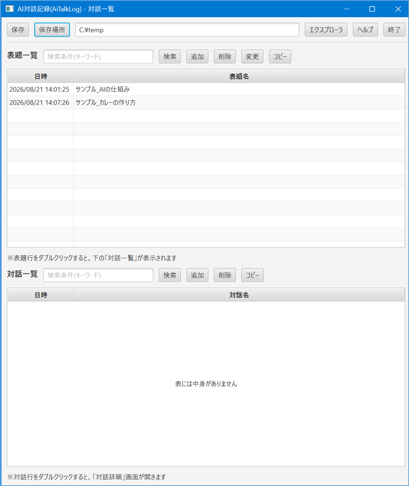
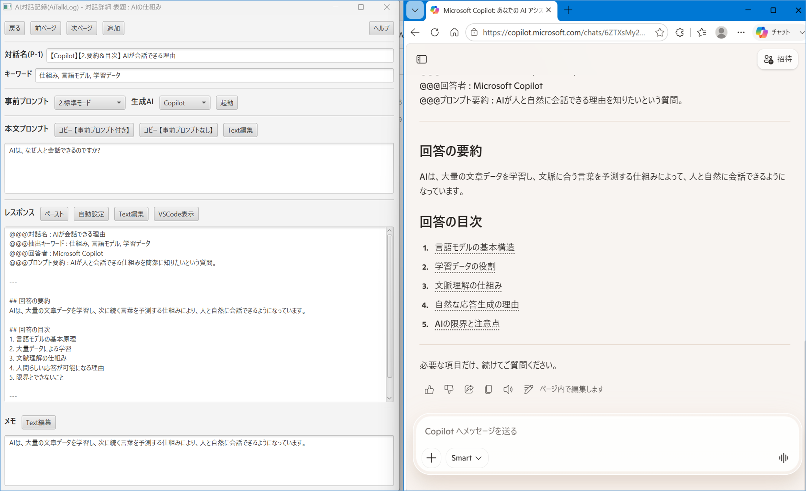

# AI対話記録ツール(AiTalkLog)

## 🚀 生成AIとの対話を「資産化」するログ管理ツール

**AiTalkLog は、生成AIとの壁打ち対話を構造化し、後から活用できる形で蓄積するためのデスクトップツールです。**  
長い対話でも「何を話したか」「どこで話したか」を見失わず、複数AIの比較も簡単に行えます。

## 🎯 特徴

生成AIとの対話を“使い捨て”にせず、後から活用できる形で蓄積するためのログ管理ツールです。

- **対話タイトル・キーワード自動生成**  
  長い壁打ちでも、後から目的の対話を一瞬で探せる。

- **表題＋対話の2階層構造**  
  1つの長いログではなく、テーマごとに整理された形で蓄積。

- **複数AIの比較が簡単**  
  Copilot / ChatGPT / Gemini / Claude を切り替えて同じプロンプトを比較可能。

- **VSCodeでレスポンス閲覧**  
  長文の回答を VSCode の落ち着いた UI で読み返せるため、ブラウザより集中できます。

- **ローカル保存・インストール不要**  
  ZIP展開だけで使え、ログはすべてローカルに保存されるため安全。

## 📥 ダウンロード

最新版はこちらからダウンロードできます。

👉 https://github.com/takeo-2026/AiTalkLog-Release/releases/latest

## 🖥️ 動作環境

- Windows 10 / 11  
- インストール不要（ZIP展開のみ）  
- レジストリ未使用  
- VSCode推奨（レスポンス閲覧用）

## ▶️ 使い方

1. ZIPを展開して AiTalkLog.exe を起動  
2. 表題（Topic）を選択  
3. 事前プロンプトと生成AIを選択  
4. 本文プロンプトを作成してコピー  
5. AIの回答を貼り付けるとタイトル・キーワードが自動生成  
6. 保存

※初回起動時にフォルダ構成が自動生成されます。

## 📸 スクリーンショット
### 📸 対話一覧
```
対話一覧画面では、表題（Topic）ごとに過去の対話を整理できます。
キーワード検索や表題の追加・編集が可能です。
```
<p align="left">
  
</p>

### 📸 対話詳細
```
対話詳細画面では、本文プロンプト・レスポンス・事前プロンプトを確認できます。
AIへの送信とログ記録を効率化する中心画面です。
```
<p align="left">
  
</p>

## 🧩 プロンプト構造

- **system_prompt.txt**：タイトル・キーワード抽出のルール  
- **事前プロンプト**：回答スタイルのテンプレート  
- **本文プロンプト**：ユーザーがAIに依頼する内容

※この3層構造により、AiTalkLogは対話内容を安定して構造化できます。


## 🤝 貢献

Issues / PR 歓迎します（個人開発のため対応はゆるやかです）。

### 📄 ライセンス

本ソフトウェアは **無保証** で提供されます。  
詳細は同梱の `LICENSE` をご確認ください。

### ⚠️ 免責事項

AiTalkLog の利用に伴うトラブル・損害について、  
作者は一切の責任を負いません。  
本ツールの動作や結果は保証されません。

## 👤 作者

Takeo Saito  

https://github.com/takeo-2026?utm_source=copilot.com
